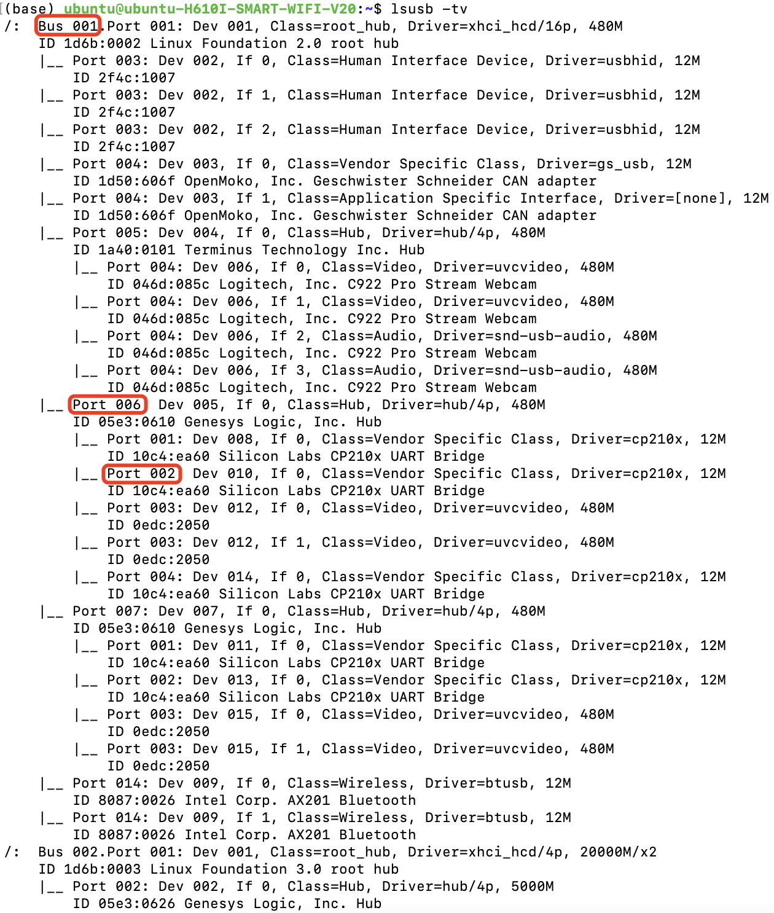
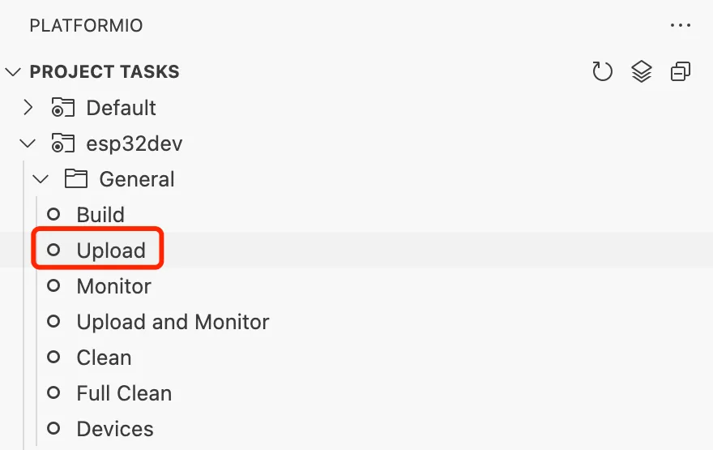

Flashing Firmware
=================

Binding USB Ports
-----------------

The USB device's name on Linux changes after each reboot, so we need to fix it. We bind USB devices via ``KERNELS``. For example, the KERNEL value of the ``/dev/video0`` device can be obtained by ``udevadm info —-name=/dev/video0 --attribute-walk | grep KERNELS`` command or by ``lsusb —tv``.

For example, in this output, ``1-6.2:1.0`` represents the device ``tty_puppet_left``:

Please follow the format in the `99-astra-fixed-port.rules <https://yaag.w5.cx/U2FsdGVkX18JWLtxzQSCU4InDpNB2fLr2vgDtLm-O_c6cfO3YwLUr62NVYAb4qclbq4g9Wy-3Zd2CEuDtzGGJ6HDWuJOhYf9vzKpqtEG2QqO6VteSwiTWs64P-3_8iVL748-uxiquYXUYx9g0anTqLcIUMvnPbz5va4snC_AxNJluMtnTQSIiYSAdX889XqneSYBclCPMF0OTVij74bEdOhPNRgE43P0nXax1TfdESs/code/astra_ws/99-astra-fixed-port.rules>`_ file to bind the USB device in `/etc/udev/rules.d/99-astra-fixed-port.rules`:

Configure the udev rules for the ODrive:

.. code-block:: bash

   sudo bash -c "curl https://cdn.odriverobotics.com/files/odrive-udev-rules.rules > /etc/udev/rules.d/91-odrive.rules"

Apply the modified configuration:

.. code-block:: bash

   sudo udevadm control --reload && sudo udevadm trigger

Flashing the Firmware of the Arm Controller
-------------------------------------------

Clone the AstraFirmwares project and its subprojects:

.. code-block:: bash

   git clone --recurse-submodules anonymized_url

Open the arm controller's firmware source code directory using VSCode/Cursor:

.. code-block:: bash

   code AstraFirmwares/AstraArmController

Install the PlatformIO plugin:

Compile the project and flash the firmware of the **right arm controller**:

Modify ``upload_port=/dev/tty_puppet_left`` in the ``platformio.ini`` file, save it, do the same as for the right arm, compile the project, and flash the firmware for the **left arm controller**.

Flashing the Firmware of the Lift Controller
--------------------------------------------

Use VSCode/Cursor to open the firmware source code directory of the lift controller:

.. code-block:: bash

   code AstraFirmwares/AstraLiftController

Compile the project, and first flash the firmware of the **right lift controller**, similar to the arm controller.

Modify the ``main.cpp``:

.. code-block:: diff

   - #define STEPPER_CORRECT_DIR(x) ((x)) // Normal (right)
   - // #define STEPPER_CORRECT_DIR(x) (-(x)) // Reversed (left)
   + // #define STEPPER_CORRECT_DIR(x) ((x)) // Normal (right)
   + #define STEPPER_CORRECT_DIR(x) (-(x)) // Reversed (left)

Modify ``upload_port=/dev/tty_puppet_lift_left`` in ``platformio.ini`` file, save the compiled project, and flash the firmware of the **left lift controller**.

Flashing the Firmware of the Head Controller
--------------------------------------------

Open the firmware source directory of the head controller using VSCode/Cursor:

.. code-block:: bash

   code AstraFirmwares/AstraHeadController

Compile the project and flash the firmware for the **head controller**.

Flashing the Firmware of the Pedal Controller
---------------------------------------------

Use VSCode/Cursor to open the firmware source directory for the pedal controller:

.. code-block:: bash

   code AstraFirmwares/AstraPedalController

Since the pedal controller is only temporarily connected to the onboard computer for flashing the firmware, you will need to find the file path to the pedal controller by plugging and unplugging the device in the ``/dev`` directory. Add ``upload_port=/dev/ttyUSB{YOUR_PATH_HERE}`` to the end of the ``platformio.ini`` file, save the compilation project, and flash the firmware for **the pedal controller**.

Configuring the ODrive Controller
---------------------------------

Updating the ODrive Controller version
~~~~~~~~~~~~~~~~~~~~~~~~~~~~~~~~~~~~~~

First, make sure the ODrive firmware is at the latest open source version ``v0.5.6``. If not, please update the firmware to version 0.5.6. Please refer to `ODrive Documentation <https://docs.odriverobotics.com/v/0.5.6/developer-guide.html>`_ (or use STM DfuSe to flash in `ODrive Releases <anonymized_url>`_)

Install ODrive Tool
~~~~~~~~~~~~~~~~~~~

Install the ODrive Tool:

.. code-block:: bash

   pip install odrive

Run the ODrive Tool, which will connect to the ODrive via the USB CDC port (not CAN):

.. code-block:: bash

   odrivetool

First, clean up the existing configuration and wait for the ODrive to automatically reboot and reconnect:

.. code-block:: python

   odrv0.erase_configuration() # with reboot

Configure Motor Parameters
~~~~~~~~~~~~~~~~~~~~~~~~~~

Configure the motor parameters:

.. code-block:: python

   # lease the protection
   odrv0.config.dc_max_negative_current = -5.0 # charging current
   odrv0.axis0.motor.config.current_lim = 20

   # set motor poles and hall encoder
   odrv0.axis0.motor.config.pole_pairs = 10 # the motor has 10 poles
   odrv0.axis0.encoder.config.mode = ENCODER_MODE_HALL # use ABC(UVW) hall encoder
   odrv0.axis0.encoder.config.cpr = 60 # pulses per rev (6 * pole num)
   odrv0.axis0.encoder.config.bandwidth = 50

   odrv0.axis0.motor.config.resistance_calib_max_voltage = 5 # voltage for calibration
   odrv0.axis0.encoder.config.calib_range = 0.1
   odrv0.axis0.encoder.config.calib_scan_distance = 150
   odrv0.axis0.motor.config.current_control_bandwidth = 1000 # related to the PD parameter of the current loop. the larger it is, the "harder" the current loop is.

   # ignore illegal_hall_state error
   odrv0.axis0.encoder.config.ignore_illegal_hall_state = True

Set up another motor in the same way:

.. code-block:: python

   odrv0.axis1.motor.config.current_lim = 20

   odrv0.axis1.motor.config.pole_pairs = 10
   odrv0.axis1.encoder.config.mode = ENCODER_MODE_HALL
   odrv0.axis1.encoder.config.cpr = 60
   odrv0.axis1.encoder.config.bandwidth = 50

   odrv0.axis1.motor.config.resistance_calib_max_voltage = 5 
   odrv0.axis1.encoder.config.calib_range = 0.1
   odrv0.axis1.encoder.config.calib_scan_distance = 150
   odrv0.axis1.motor.config.current_control_bandwidth = 1000

   odrv0.axis1.encoder.config.ignore_illegal_hall_state = True

Wait 1 second for the communication between the upper and lower computer to complete, save the configuration, and reboot:

.. code-block:: python

   # wait for 1 second

   odrv0.save_configuration()
   odrv0.reboot()

Calibrate the Encoder
~~~~~~~~~~~~~~~~~~~~~

The encoder can then be calibrated:

.. code-block:: python

   odrv0.axis0.requested_state = AXIS_STATE_FULL_CALIBRATION_SEQUENCE # start calibration

A beep will come from the driver board, please make sure that the motor is not touching the ground. After that, the motor will rotate a few times by itself, wait for the motor to stop, save the calibration parameters, and restart:

.. code-block:: python

   odrv0.axis0.encoder.config.pre_calibrated = True
   odrv0.axis0.motor.config.pre_calibrated = True

   # wait for 1 second

   odrv0.save_configuration()
   odrv0.reboot()

Follow the same way to calibrate another motor:

.. code-block:: python

   odrv0.axis1.requested_state = AXIS_STATE_FULL_CALIBRATION_SEQUENCE # start calibration

   # wait until motor stop

   odrv0.axis1.encoder.config.pre_calibrated = True
   odrv0.axis1.motor.config.pre_calibrated = True

   # wait for 1 second

   odrv0.save_configuration()
   odrv0.reboot()

Setting the Motion Mode
~~~~~~~~~~~~~~~~~~~~~~~

Set the motor to position mode and enable trapezoidal acceleration and deceleration:

.. code-block:: python

   # position mode and tune the parameters
   odrv0.axis0.controller.config.control_mode = CONTROL_MODE_POSITION_CONTROL
   odrv0.axis0.controller.config.pos_gain = 20
   odrv0.axis0.controller.config.vel_gain = 0.10
   odrv0.axis0.controller.config.vel_integrator_gain = 0

   # trapezoidal acceleration and deceleration:
   odrv0.axis0.controller.config.input_mode = INPUT_MODE_TRAP_TRAJ
   odrv0.axis0.controller.config.vel_limit = 20
   odrv0.axis0.trap_traj.config.vel_limit = 20
   odrv0.axis0.trap_traj.config.accel_limit = 1
   odrv0.axis0.trap_traj.config.decel_limit = 1

   # # start closed loop control
   # odrv0.axis0.requested_state = AXIS_STATE_CLOSED_LOOP_CONTROL
   # odrv0.axis0.config.startup_closed_loop_control = True

   # # test
   # odrv0.axis0.controller.input_pos = 5

Set another motor in the same way:

.. code-block:: python

   # position mode and tune the parameters
   odrv0.axis1.controller.config.control_mode = CONTROL_MODE_POSITION_CONTROL
   odrv0.axis1.controller.config.pos_gain = 20
   odrv0.axis1.controller.config.vel_gain = 0.10
   odrv0.axis1.controller.config.vel_integrator_gain = 0

   # trapezoidal acceleration and deceleration:
   odrv0.axis1.controller.config.input_mode = INPUT_MODE_TRAP_TRAJ
   odrv0.axis1.controller.config.vel_limit = 20
   odrv0.axis1.trap_traj.config.vel_limit = 20
   odrv0.axis1.trap_traj.config.accel_limit = 1
   odrv0.axis1.trap_traj.config.decel_limit = 1

   # # start closed loop control
   # odrv0.axis1.requested_state = AXIS_STATE_CLOSED_LOOP_CONTROL
   # odrv0.axis1.config.startup_closed_loop_control = True

   # # test
   # odrv0.axis1.controller.input_pos = 0

Save the parameters and restart:

.. code-block:: python

   # wait for 1 second

   odrv0.save_configuration()
   odrv0.reboot()

Debugging Tips
~~~~~~~~~~~~~~

If you find that your version of ODrive suddenly doesn't work, you can dump the current error status:

.. code-block:: python

   # for any errors
   dump_errors(odrv0)
   odrv0.clear_errors()

ODrive also provides a live plot tool:

.. code-block:: python

   # for live plot
   import matplotlib; matplotlib.use('TkAgg');
   start_liveplotter(lambda: [
       odrv0.axis0.encoder.count_in_cpr,
       odrv0.axis0.encoder.pos_estimate_counts,
   ])

References
----------

- https://blog.csdn.net/gjy_skyblue/article/details/115412902
- https://docs.odriverobotics.com/v/0.5.4/hoverboard.html
- https://docs.odriverobotics.com/v/0.5.6/encoders.html
- https://blog.csdn.net/gjy_skyblue/article/details/118159153
- https://docs.odriverobotics.com/v/0.5.6/getting-started.html
- https://docs.odriverobotics.com/v/0.5.6/control.html
- https://things-in-motion.blogspot.com/2018/12/how-to-select-right-power-source-for.html
