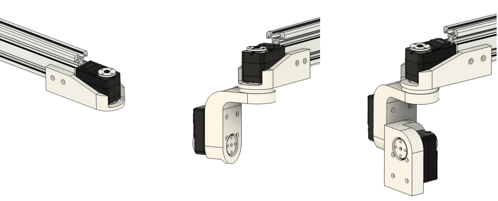

Hardware Assembly Guide
=======================

This guide will help you build a complete RBNAME system. The RBNAME installation order follows the same sequence as the BOM list, using a mechanical-first then electrical approach, and base-first then upper-body approach. This document will introduce the recommended component installation sequence. The complete robot design files for RBNAME are stored in Astra.STEP. You can view this file to determine the accurate installation orientation and position. If you don't have CAD software installed, we recommend using Autodesk Fusion as your viewing tool.

`Astra.STEP <https://yaag.w5.cx/U2FsdGVkX18JWLtxzQSCU4InDpNB2fLr2vgDtLm-O_c6cfO3YwLUr62NVYAb4qclbq4g9Wy-3Zd2CEuDtzGGJ6HDWuJOhYf9vzKpqtEG2QqO6VteSwiTWs64P-3_8iVL748-uxiquYXUYx9g0anTqLcIUMvnPbz5va4snC_AxNJluMtnTQSIiYSAdX889XqneSYBclCPMF0OTVij74bEdOhPNRgE43P0nXax1TfdESs/code/Astra_Hardwares/Astra/Astra.STEP>`_

Assembling the Base and Lifting Frame
-------------------------------------

First, use aluminum profiles to assemble the chassis frame, and secure this framework firmly using M8*30 socket head cap screws.

Please first install the motors and photoelectric switches on the rails. Then use two flat aluminum corner brackets to mount the rails to the chassis. Ensure that the stepper motor's top surface is flush with the 3060 aluminum profile, and that the rail's front surface is 20.3mm away from the profile (refer to the complete installation image- this step ensures the rail is centered on the 3090 block).

⚠️ This step should preferably be completed by two people - one person holds the rail steady while the other installs the screws.

💡 Since there's a fine-tuning process for installing components, don't fully tighten the screws in one step. Ensure the installation requirements for this step are met before final tightening.

⚠️ Be careful of sharp corners on the brackets that could cause injury! Please be cautious when applying force.

Continue using corner brackets to install the two connecting blocks, then install the front 30120 aluminum profile reinforcement structure and secure it with M8 bolts. Ensure that the 3090 aluminum profile and 30120 aluminum profile form a right-angle relationship after installation.

💡 After completing this step, there's no need to rush installing the rear 30120 reinforcement structure and computer support structures.

.. image:: images/9181754239577_.pic.jpg
   :alt: Connecting blocks installation

Lay the assembled robot down and install the drive wheels.

💡 Please install the hub motor front fork brackets first, then install the motors.

At this point, your chassis installation is complete. You can perform initial testing to see if the chassis and lifting platform work properly (refer to the Flashing Firmware chapter).

⚠️ When testing hub motors, please raise the frame to avoid sudden robot movement that could cause injury.

⚠️ Please ensure the lifting platform photoelectric switches are correctly installed and connected to the ESP32.

After completing the tests, you can continue installing the subsequent computer support structure. As shown in the images, install the corresponding profiles and complete the installation and securing using M8 screws and flat corner brackets.

Arms and Wrists
---------------

First, complete the installation of the shoulder dual-motor module:

💡 The entire robot uses Phillips countersunk screws to secure servos to structural components, all of the same specification.

💡 Use appropriate M3 screws to complete the connection between servo horns and mechanisms (please complete this step here).

As well as the elbow dual-motor module installation:

Connect the assembled modules to the profiles to complete the upper arm and lower arm assembly. The left arm installation steps are identical to the right arm installation.

Next, install the wrist. The wrist uses sequential installation, connecting one joint at a time in series. Using the right wrist as an example:

💡 Between the servo and the next structural component, please install an AXK2035 thrust needle roller bearing to bear non-axial moments.

Gripper installation requires installing the rail first, then mounting the two gripper heads to the gripper. Please ensure the rack and pinion are properly connected.

Similar to the wrist steps, complete the installation of the head pan-tilt unit.

Mount the gripper to the arm, then install the arms and head pan-tilt unit to the lifting platform to complete the installation.

🎉 You have now completed the entire AhaRobot installation.
