Teleoperation Handle Installation and Testing
=============================================

Creating the Handle
-------------------

Download the PDF file, print the Markers using duplex printing with 100% scaling (no scaling)

`marker_array.pdf <https://yaag.w5.cx/U2FsdGVkX18JWLtxzQSCU4InDpNB2fLr2vgDtLm-O_c6cfO3YwLUr62NVYAb4qclbq4g9Wy-3Zd2CEuDtzGGJ6HDWuJOhYf9vzKpqtEG2QqO6VteSwiTWs64P-3_8iVL748-uxiquYXUYx9g0anTqLcIUMvnPbz5va4snC_AxNJluMtnTQSIiYSAdX889XqneSYBclCPMF0OTVij74bEdOhPNRgE43P0nXax1TfdESs/code/astra_ws/non_ros_src/astra_teleop/src/astra_teleop/marker_array.pdf>`_

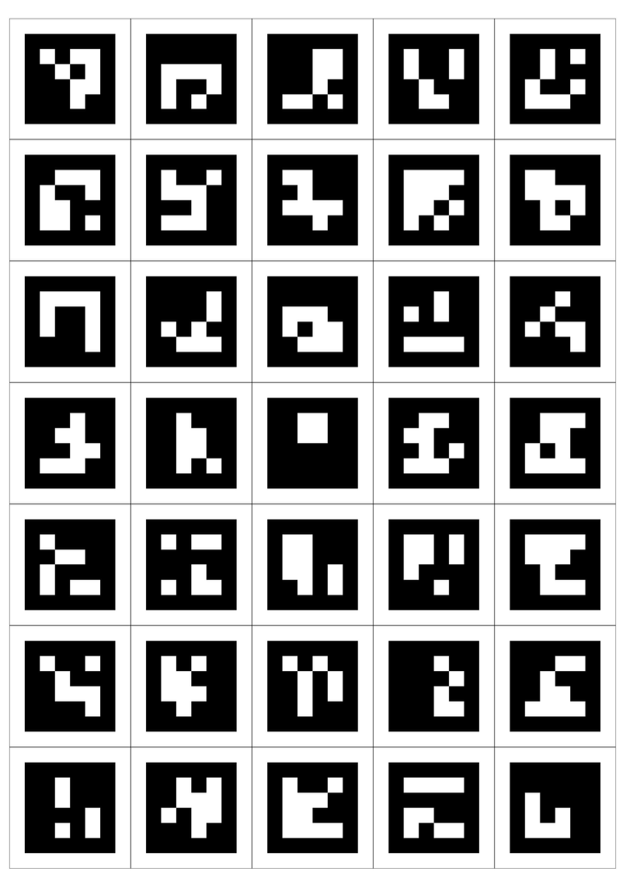

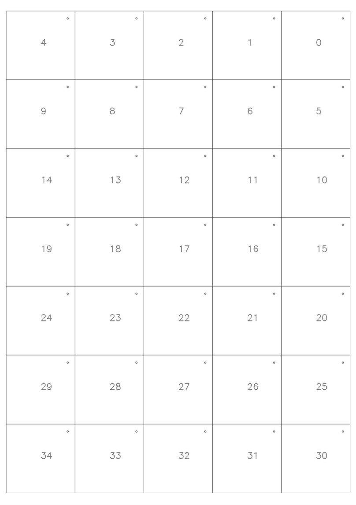

Cut along the dotted lines. Marker IDs and orientation dots are marked on the back. Note: The right handle uses Markers ID 0-16. The left handle uses Markers ID 18-30. Marker ID 17 should be ignored. Apply Markers counterclockwise from the top using double-sided tape for best results

Right Handle
~~~~~~~~~~~~

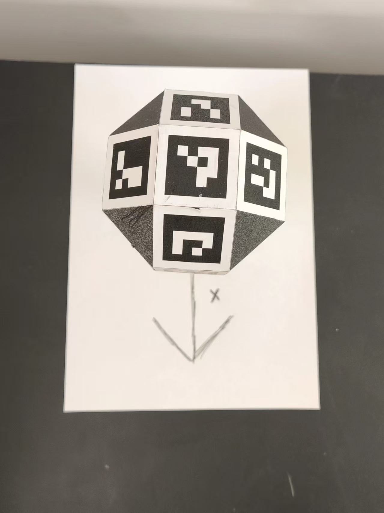

Top View

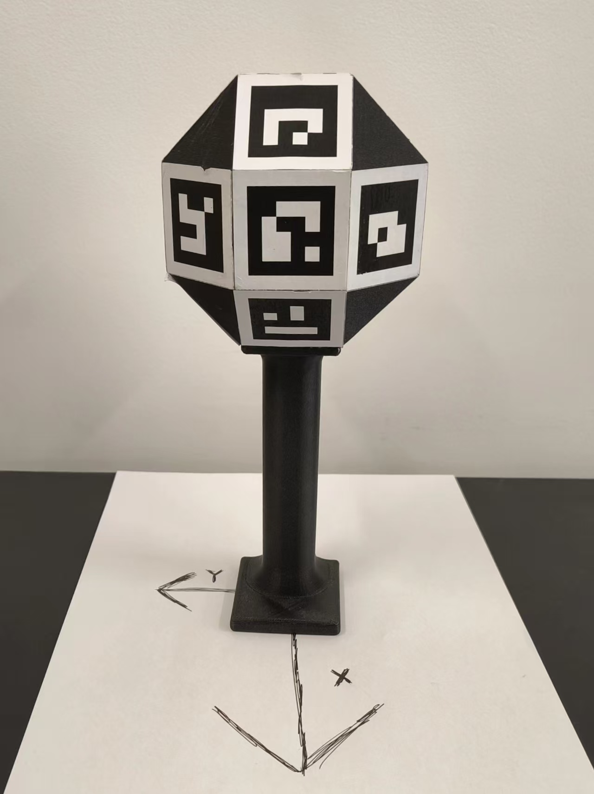

Front View

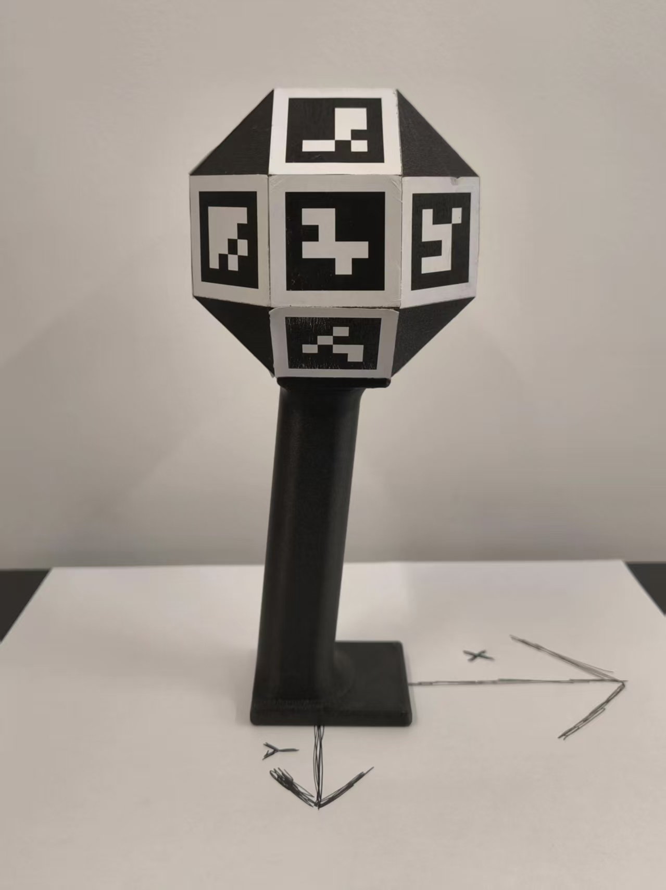

Left View

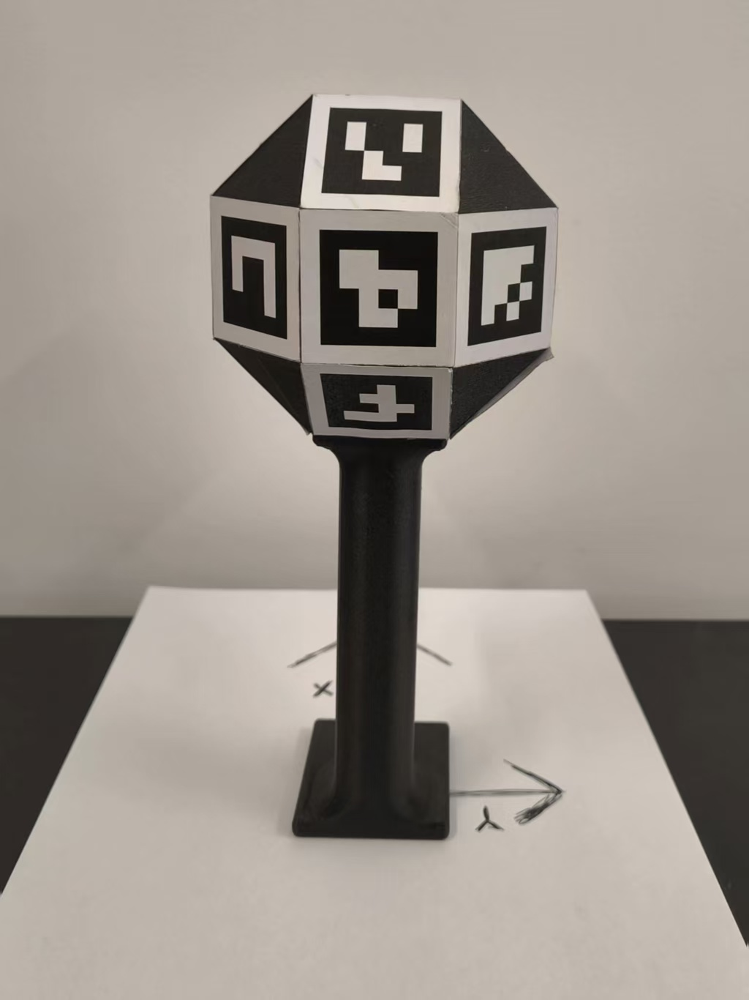

Back View

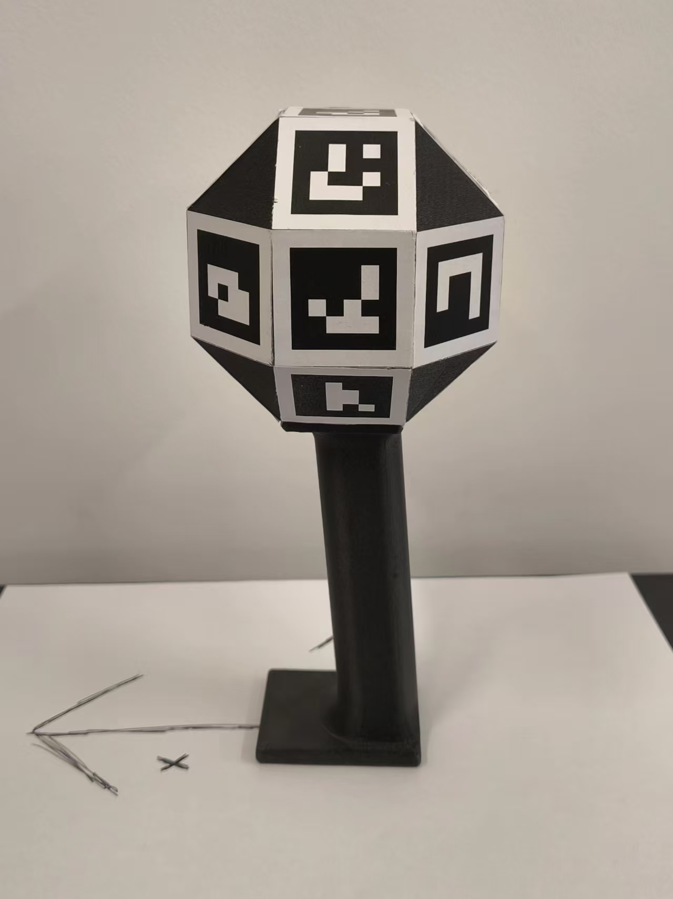

Right View

Left Handle
~~~~~~~~~~~

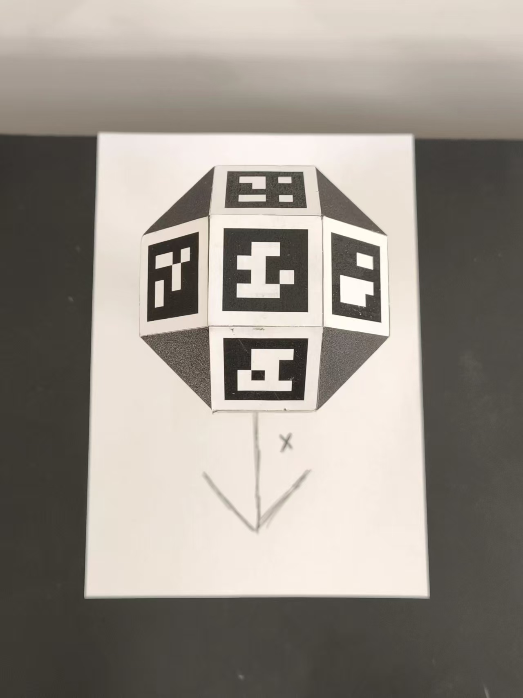

Top View

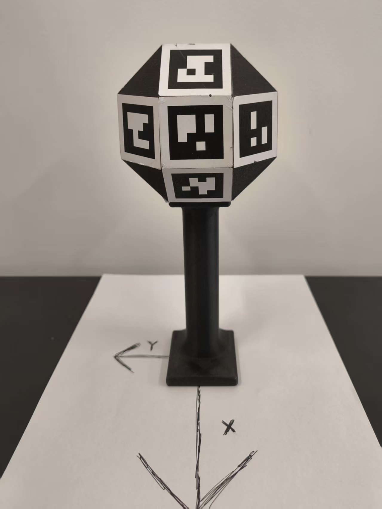

Front View

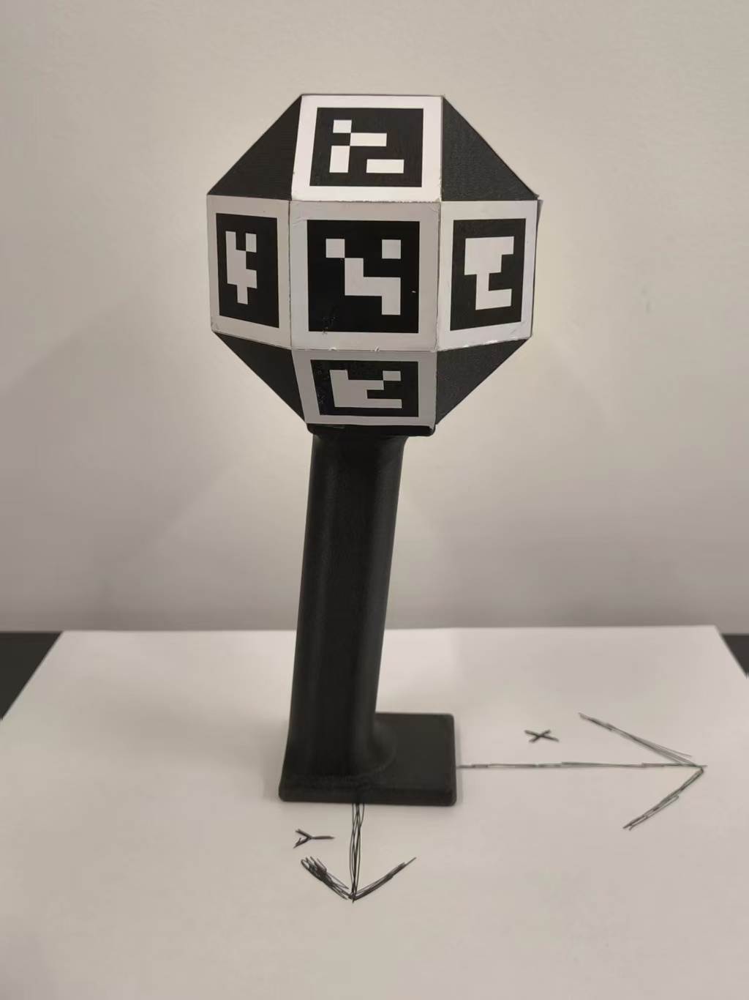

Left View

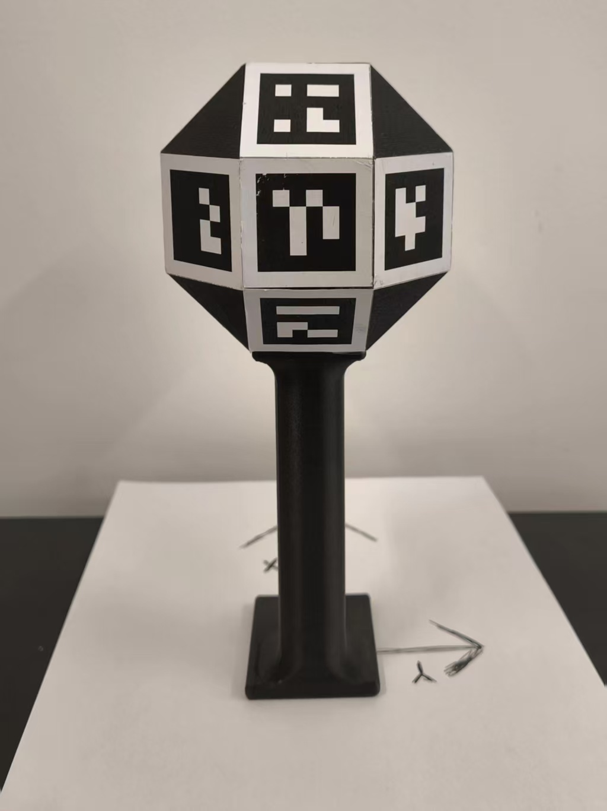

Back View

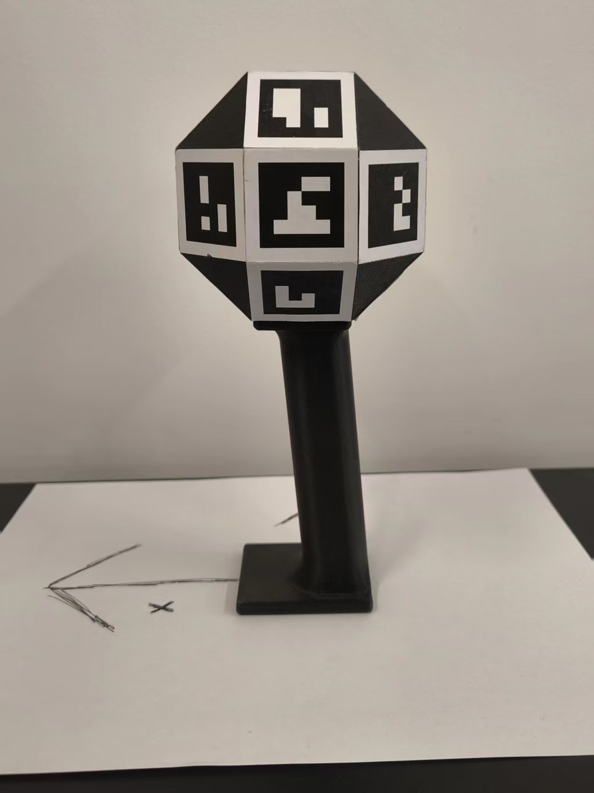

Right View

Creating Calibration Board
--------------------------

Download the calibration board file and attach it to a flat surface:

`calibration_board.png <anonymized_url>`_

Camera Intrinsic Calibration (Test)
-----------------------------------

Install dependencies:

.. code-block:: bash

   # Install Dependance First
   git clone anonymized_url
   cd astra_teleop
   pip install -e .

Collect calibration images:

.. code-block:: bash

   python -m astra_teleop.calibration_collect -d /dev/video0 -c ./calibration_images

Move the calibration board in front of the camera:

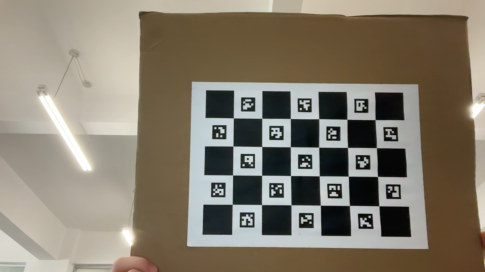

Process calibration images:

.. code-block:: bash

   python -m astra_teleop.calibration_process -c ./calibration_images

Sample output (results saved to ``calibration_images/teleoperation_calibration_results_{%Y%m%d%H%M%S}.yaml``):

.. code-block:: yaml

   # Camera intrinsic parameters
   camera_matrix:
     rows: 3
     cols: 3
     data: [fx, 0, cx, 0, fy, cy, 0, 0, 1]
   
   # Distortion coefficients
   dist_coeffs:
     rows: 1
     cols: 5
     data: [k1, k2, p1, p2, k3]
